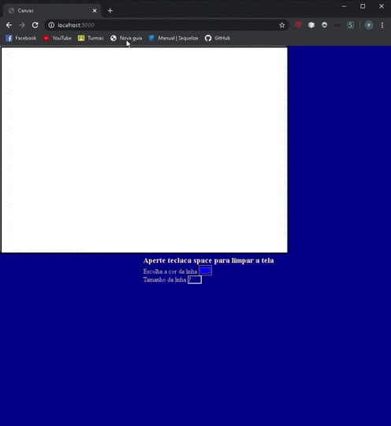

# Javascript-Vanilla

  

Um sistema de desenho utilizando canvas e socket.io que permite o desenhar em várias telas ao mesmo tempo. 

  

## ⁉️Instalação 

  

Utilizar o npm para instalação do projeto. 

```bash 

npm install 

``` 

  

## Uso 

  

Para rodar o projeto utilize o comando: 

```bash 

node index.js 

``` 

Depois basta acessar http://localhost:3000/ no navegador.

  

## 💻Tecnologia

  

-NodeJs 

-HTMl

-CSS

-JavaScript

-Socket.io


## 👤Autor
Eduardo Tomacheski


Github: [@Eduardo Tomacheski](https://github.com/ETomacheski) 


LinkedIn: [@Eduardo Tomacheski](https://www.linkedin.com/in/eduardo-tomacheski-a86b1617a/) 
